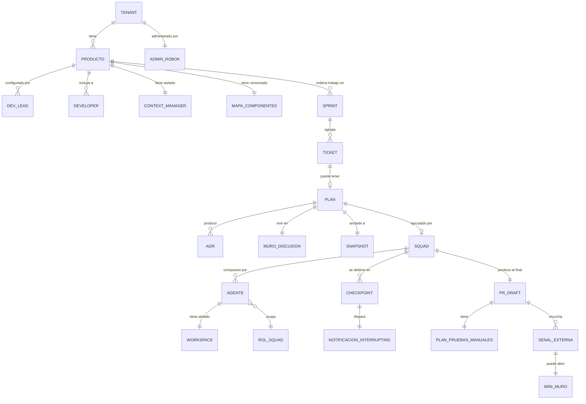

# ROBOK — Glosario y modelo conceptual

> **Propósito de este doc:** fijar los términos canónicos del producto. Sin esto, los casos de uso terminan diciendo "el plan", "la propuesta", "el documento de diseño", "el ADR" como si fueran cosas distintas o iguales sin saber. Con esto, hay UN nombre para cada concepto y una relación clara entre ellos.
>
> **Regla de uso:** cuando construyas un caso de uso o un prototipo, los nombres de las pantallas, botones y acciones DEBEN salir de este glosario. Si necesitás un término nuevo, agregalo acá primero.

---

## Glosario — términos canónicos

### Entidades de negocio

**Tenant**
Organización que tiene una instancia de ROBOK. Tiene un Admin de ROBOK y N productos. Es la unidad de facturación y de gobernanza top-level.

**Producto**
Unidad organizacional alrededor de la que viven equipos, repos, decisiones y contexto. Provisionado por el Admin de ROBOK. Configurado por uno o más Dev Leads. **Cada producto tiene Context Manager aislado.** Ejemplos: "Promise Engine", "Ratings & Reviews".

**Equipo del producto**
Conjunto de personas mapeadas dentro de un producto, con roles diferenciados (Dev Lead, Developer). El Admin de ROBOK NO es parte del equipo del producto necesariamente.

**Sprint actual**
Ventana temporal de planificación del equipo (típicamente 2 semanas, configurable). Es el frame que ROBOK usa para mostrar el backlog enriquecido en Etapa 2. ROBOK no asume Scrum — soporta kanban y otras unidades.

**Backlog enriquecido**
Vista del sprint actual donde cada ticket viene anotado por Rob con preestimación, dependencias, calidad de spec, módulos que toca, riesgos.

---

### Entidades del ciclo de historia

**Ticket**
Unidad de trabajo del equipo, originada en el sistema de gestión (típicamente Jira). NO es propiedad de ROBOK — ROBOK la lee y la enriquece. Estados: en sprint, marcado para Rob, en análisis, en implementación, en pre-merge, cerrado.

**Pre-marcado para Rob**
Ticket etiquetado en el sistema externo (Jira label, custom field) durante el planning para indicar que es candidato a delegar. ROBOK lo lee como input de Etapa 2.

**Marcado para Rob (decisión final)**
Ticket que el Dev Lead decide delegar a Rob dentro de ROBOK, en Etapa 2. Diferente del pre-marcado: el pre-marcado es candidato, el marcado es decisión.

**Plan**
Artefacto producido por Rob en Etapa 3. Contiene: descomposición en tareas, ADRs propuestos, casos de prueba, estrategia de ramas, agentes que van a trabajar, checkpoints, riesgos, matriz costo×tiempo. **Vive en el muro de discusión, no es un PDF.**

**Plan cancelado guardado**
Plan que el Dev Lead canceló en Etapa 3 pero que queda persistido. Si se retoma en otro sprint, Rob hace refresh sobre el plan existente, no análisis desde cero.

**ADR (Architectural Decision Record)**
Decisión arquitectónica tomada como parte de un plan o durante la implementación. **Nace en el muro de discusión**, no después. Cada ADR tiene referencia al snapshot del producto en el momento de la decisión.

**Snapshot del producto**
Foto inmutable del estado del producto (mapa de componentes + convenciones + contexto) en un momento dado. Cada plan, decisión y ADR queda anclado a un snapshot. Es lo que permite auditoría a 6 meses.

**Modo de ejecución**
Trade-off costo × tiempo elegido por el Dev Lead al delegar una historia. Cuatro modos en V1: **Express**, **Estándar**, **Económico**, **Sprint-pace**.

**Quórum**
Regla configurable a nivel producto sobre cuántos aprobadores requiere una historia. Ejemplos: "historias > USD 500 requieren 2 dev leads", "historias que toquen módulo X requieren aprobador específico".

---

### Entidades del squad

**Squad**
Conjunto de agentes asignados a una historia específica en Etapa 4. Tiene 1 a 8 agentes. **No es una entidad permanente** — nace cuando se aprueba un plan y muere cuando la historia se cierra.

**Rol del squad**
Función canónica que un agente puede ocupar. Seis roles en V1: **🎨 Architect**, **🔨 Implementer**, **🧪 Tester**, **👀 Reviewer**, **📝 Doc-writer**, **🛡️ Security Reviewer**. Configurables por producto (qué LLM usa, qué skills, qué prompts).

**Agente**
Instancia de un rol del squad trabajando en una tarea específica. Ejemplo: "Implementer #1" e "Implementer #2" son dos agentes del mismo rol en un mismo squad.

**Workspace del agente**
Espacio aislado (git worktree o equivalente) donde un agente trabaja sin pisarse con otros agentes del mismo squad.

**Orchestrator**
Agente coordinador opcional que activa ROBOK cuando un squad necesita coordinación entre varios agentes. Integra los resultados al final de cada checkpoint.

**Checkpoint**
Punto del plan donde el squad pausa y espera al humano. **No-negociable**: ROBOK no avanza sin el Dev Lead en checkpoints duros, aunque sea overnight, aunque sea Sprint-pace.

**Double-texting**
Capacidad del Dev Lead de mandar mensajes al squad o a un agente específico mientras está corriendo, sin reiniciarlo. El mensaje se inyecta en la siguiente decisión del agente.

**Drill-down**
Acción de hacer click en un agente para ver su detalle profundo (archivo en edición, tool calls, contexto, decisiones recientes). Abre panel lateral, no navega afuera.

---

### Entidades de la pantalla

**Vista del producto**
Pantalla de aterrizaje de un producto. Muestra el sprint actual, las historias en curso, el dashboard, accesos al mapa de componentes, configuración.

**Mapa de componentes**
Vista permanente del producto que muestra repos, servicios, infra, dependencias. Doble uso: entender el sistema y acotar scope al delegar una historia. **Está versionado** — cuando creaste la historia el mapa tenía X forma.

**Vista del squad**
Pantalla central de la Etapa 4. Tres zonas: Status Bar (top), Equipo en acción (centro, cards de cada agente), Timeline editorial (derecha).

**Status Bar**
Banda superior de la vista del squad. Muestra progreso, modo, costo vs presupuesto, estado global. Siempre visible.

**Cards del equipo en acción**
Componente central de la vista del squad. Una card por agente activo. Muestra: rol, tag, tarea actual, status visual, mini-progreso, última acción.

**Timeline editorial**
Feed scrollable de eventos importantes en la vista del squad. NO es log de tool calls — es editorial, filtrable, con jump-to-artifact.

**Muro de discusión**
Pantalla central de la Etapa 3. Espacio compartido donde Rob, Dev Lead y otros humanos/agentes discuten el plan. **Es el lugar donde nacen los ADRs.** Idas y vueltas hasta cerrar.

**Mini-muro de discusión**
Variante del muro que aparece en Etapa 5 cuando una prueba manual falla. Misma mecánica (diagnóstico + clasificación + decisión humana) pero con scope más acotado.

**Insight inicial**
Resumen proactivo que Rob produce al final del onboarding. Contiene: resumen del producto, stack detectado, estructura, convenciones, actividad reciente, dudas explícitas, equipo mapeado.

**Dashboard**
Pantalla con vista agregada de las historias en curso de un producto: estado, costos, modo, tiempo restante.

**Vista del tenant (admin)**
Pantalla de Marisol. Muestra productos del tenant, costos agregados, salud, asignación de admins.

---

### Entidades de status y notificación

**Status en 4 capas**
Modelo de presencia adaptativa de ROBOK:
- **Ambient**: badge persistente, no demanda atención.
- **Glanceable**: hover/click rápido para resumen, demanda voluntaria.
- **Interrupting**: notificación con acción cuando ROBOK necesita al humano, demanda obligatoria.
- **Summary**: reporte completo al cierre, voluntario.

**Notificación interrupting**
Notificación que demanda acción del humano (típicamente en checkpoints). Llega por ROBOK + Slack/Teams. **V1 = link a la pantalla de aprobación en ROBOK. V2 = aprobar desde Slack/Teams.**

**Reporte de cierre**
Resumen completo que aparece cuando un squad termina (Etapa 4 → Etapa 5). Contiene: PRs, ADRs, tests escritos, costo real vs estimado.

---

### Entidades de contexto

**Context Manager**
Componente interno de ROBOK que cura y entrega contexto a los agentes. Aislado por producto. Lee de Confluence, repos, IaC, Jira.

**Fuentes de contexto**
Lo que el Context Manager indexa al onboardear un producto: documentación (Confluence), código (repos), infraestructura (repos de IaC), gestión de trabajo (Jira).

**Convenciones detectadas**
Patrones que Rob infiere del código y la doc del producto durante el onboarding: naming, ubicación de tests, estructura de CI/CD, etc. **Sujetas a confirmación humana** antes de que Rob actúe sobre ellas.

---

### Entidades del Pre-merge Gate (Etapa 5)

**Validaciones automatizadas**
Conjunto de checks que se corren antes de abrir el PR draft: unit tests, lint, type check, SAST, secret scanning, dependency scan.

**PR draft**
Pull request en estado borrador que se abre al final de las validaciones automatizadas, NO al inicio del trabajo. Marca el momento en que el cycle time empieza a "cerrarse".

**Plan de pruebas manuales**
Checklist estructurado que Rob postea como comentario en Jira al abrir el PR. Cada item tiene template predefinido para que el humano marque resultado.

**External signal listening**
Comportamiento del squad después de abrir el PR. **Squad no se desactiva** — escucha eventos del pipeline (CI, SAST, dependency scan) y responde con uno de cuatro caminos: auto-fix, vuelta a Etapa 3, excepción aprobada, bloqueante.

**Cuatro caminos de respuesta a señales externas**
- **Auto-fix**: errores menores y mecánicos. Security Reviewer redacta el fix, Implementer lo ejecuta.
- **Vuelta a Etapa 3**: errores que cambian el diseño. Se abre thread en el muro.
- **Excepción aprobada**: falso positivo conocido. Se ignora con justificación, queda como ADR.
- **Bloqueante absoluto**: secret leakeado, CVE crítica en core. Merge denegado.

---

## Modelo conceptual — cómo se relacionan las entidades

---

## Reglas de naming en pantalla

Para que el prototipo HTML sea consistente, estos son los nombres que aparecen en pantalla:

| Concepto técnico             | Nombre en pantalla              | Notas                                        |
| ---------------------------- | ------------------------------- | -------------------------------------------- |
| Producto                     | Nombre real del producto        | "Promise Engine", no "Producto #1"           |
| Sprint actual                | "Sprint actual"                 | No "Iteration N" ni "Cycle 14"               |
| Ticket marcado para Rob      | "Para Rob" + estado             | Ej: "Para Rob — En análisis"                 |
| Plan                         | "Plan"                          | No "Diseño", no "Documento técnico"          |
| Muro de discusión            | "Muro"                          | Corto en breadcrumbs                         |
| Squad                        | "Squad"                         | Sin traducción al español                    |
| Agente Architect             | "🎨 Architect"                  | Emoji + rol en inglés (consistencia técnica) |
| Modo Sprint-pace             | "Sprint-pace · Eco · Std · Express" | Pills cortos                            |
| Estado del squad: trabajando | 🟢 Trabajando                   | Verde                                        |
| Estado del squad: esperando  | 🟡 Esperándote                  | Amarillo + segunda persona                   |
| Estado del squad: bloqueado  | 🔴 Bloqueado                    | Rojo                                         |
| Estado del squad: terminado  | ✅ Terminado                    | Verde con check                              |
| Insight inicial              | "Lo que entendí del producto"   | Lenguaje cercano, primera persona de Rob     |
| Mapa de componentes          | "Mapa"                          | Corto. Pestaña fija de la vista del producto |

---

## Términos que NO se deben usar (anti-glosario)

| ❌ No decir                  | ✅ Decir                                  | Por qué                                                                |
| --------------------------- | ---------------------------------------- | ---------------------------------------------------------------------- |
| "El bot"                    | "Rob" o "ROBOK" o "el squad"             | Bot trivializa el producto. ROBOK no es un chatbot.                    |
| "Conversación con Rob"      | "Muro de discusión" o "preguntá a Rob"   | Conversación implica chat lineal. El muro es un espacio compartido.    |
| "Ejecutar un comando"       | "Delegar una historia"                   | ROBOK no es CLI.                                                       |
| "Run / Execution"           | "Squad activo" o "historia en curso"     | Lenguaje de máquina, no de equipo.                                     |
| "Logs"                      | "Timeline" o "drill-down"                | Logs es para developers en producción. ROBOK muestra trabajo, no logs. |
| "Configurar el agente"      | "Configurar el rol del squad"            | Los roles son canónicos. La unidad de configuración es el rol.         |
| "Workflow / Pipeline"       | "Plan" o "Etapa"                         | ROBOK tiene Etapas (1-5), no pipelines.                                |
| "Job" / "Task" sin contexto | "Tarea del plan" o "agente trabajando en"| Task es ambiguo en este dominio.                                       |
| "Aprobar el documento"      | "Aprobar el plan en el muro"             | El plan no es un documento — vive en el muro.                          |
| "Confirmar"                 | "Aprobar" / "Dale" / "Validar"           | Confirmar es de wizards. ROBOK valida conversando.                     |

---

## Cuándo usar cada término — ejemplos

**Bien:**
- "Vera entra al producto Promise Engine y ve el sprint actual con backlog enriquecido."
- "El squad llegó a un checkpoint y notificó a Vera por Slack."
- "El plan se discute en el muro hasta que Vera lo aprueba en modo Sprint-pace."

**Mal:**
- "Vera entra al bot Promise Engine y ve los tickets pendientes." (bot, tickets pendientes)
- "El agente terminó su run y mandó un log." (agente sin contexto, run, log)
- "El plan se aprueba en un workflow de configuración." (workflow no existe en ROBOK)
