# ROBOK — Inventario de pantallas y vistas (Information Architecture)

> **Propósito de este doc:** listar exhaustivamente las pantallas que existen en ROBOK V1, qué muestran, cómo se conectan, qué estados tienen y quién accede. Es el mapa que el constructor del prototipo HTML va a usar para saber "qué pantallas tengo que dibujar".
>
> **Regla de inclusión:** una pantalla entra en este inventario solo si aparece en al menos un journey de ROBOK v5 o si es necesaria para que un journey funcione. Sin pantallas inventadas.
>
> **Lo que esto NO es:** wireframes ni mockups. Es la lista, la descripción funcional y los estados. El layout concreto está en el doc de componentes UI y en el prototipo final.

---

## Mapa global de navegación

```mermaid
flowchart LR
    LOGIN[Login / SSO] --> SEL[Selector de productos]
    SEL --> PROD[Vista del producto]
    SEL --> ADMIN[Panel del tenant<br/>solo Admin de ROBOK]

    PROD --> ONBOARD[Onboarding del producto<br/>solo primera vez]
    PROD --> SPRINT[Sprint actual<br/>backlog enriquecido]
    PROD --> CURSO[Mis historias en curso]
    PROD --> MAPA[Mapa de componentes]
    PROD --> CONFIG[Configuración del producto]

    ONBOARD --> INSIGHT[Insight inicial proactivo]
    INSIGHT --> PROD

    SPRINT --> TICKET[Detalle de ticket anotado]
    TICKET --> SCOPE[Confirmación de scope]
    SCOPE --> ANALISIS[Análisis profundo en curso]
    ANALISIS --> MURO[Muro de discusión del plan]
    MURO --> APROBADO[Plan aprobado]
    MURO --> CANCELADO[Plan cancelado guardado]

    CURSO --> SQUAD[Vista del squad activo]
    APROBADO --> SQUAD
    SQUAD --> DRILL[Drill-down de agente]
    SQUAD --> CHECK[Pantalla de checkpoint]

    SQUAD --> CIERRE[Reporte de cierre]
    CIERRE --> GATE[Pre-merge Gate]
    GATE --> JIRA[Plan de pruebas en Jira<br/>fuera de ROBOK]
    GATE --> MINIMURO[Mini-muro de fallo]
    GATE --> PRMERGE[PR mergeado / Cycle time]

    style LOGIN fill:#37474f,stroke:#37474f,color:#fff
    style SEL fill:#01579b,stroke:#01579b,color:#fff
    style PROD fill:#01579b,stroke:#01579b,color:#fff
    style ADMIN fill:#37474f,stroke:#37474f,color:#fff
    style ONBOARD fill:#bf360c,stroke:#bf360c,color:#fff
    style INSIGHT fill:#880e4f,stroke:#880e4f,color:#fff
    style SPRINT fill:#01579b,stroke:#01579b,color:#fff
    style CURSO fill:#01579b,stroke:#01579b,color:#fff
    style MAPA fill:#37474f,stroke:#37474f,color:#fff
    style CONFIG fill:#37474f,stroke:#37474f,color:#fff
    style TICKET fill:#37474f,stroke:#37474f,color:#fff
    style SCOPE fill:#bf360c,stroke:#bf360c,color:#fff
    style ANALISIS fill:#4a148c,stroke:#4a148c,color:#fff
    style MURO fill:#01579b,stroke:#01579b,color:#fff
    style APROBADO fill:#1b5e20,stroke:#1b5e20,color:#fff
    style CANCELADO fill:#37474f,stroke:#37474f,color:#fff
    style SQUAD fill:#4a148c,stroke:#4a148c,color:#fff
    style DRILL fill:#37474f,stroke:#37474f,color:#fff
    style CHECK fill:#bf360c,stroke:#bf360c,color:#fff
    style CIERRE fill:#1b5e20,stroke:#1b5e20,color:#fff
    style GATE fill:#01579b,stroke:#01579b,color:#fff
    style JIRA fill:#616161,stroke:#616161,color:#fff,stroke-dasharray: 5 5
    style MINIMURO fill:#01579b,stroke:#01579b,color:#fff
    style PRMERGE fill:#1b5e20,stroke:#1b5e20,color:#fff
```

---

## Inventario completo — 18 pantallas en V1

### Bloque A — Acceso y selección (2 pantallas)

#### A1. Login / SSO
**Quién entra:** todos.
**Qué muestra:** logo de ROBOK, botón "Entrar con SSO".
**Qué hace:** autentica al usuario. Identidad y permisos vienen del proveedor de identidad de la empresa.
**Estados:** sin autenticar, autenticando, error.
**Salida:** lleva al Selector de productos.
**Para el prototipo:** página simple, simulada (basta con un botón "Entrar").

---

#### A2. Selector de productos
**Quién entra:** todos los humanos al iniciar sesión.
**Qué muestra:** lista de productos a los que la persona pertenece. Cada producto se muestra con: nombre, mini-stats (historias en curso, costo este sprint), badge de notificación si hay algo pendiente.
**Qué hace:** permite elegir un producto para entrar. Si la persona es Admin de ROBOK, muestra adicionalmente acceso al panel del tenant.
**Estados:**
- Tiene 1 producto solo → opcionalmente auto-redirect.
- Tiene N productos → grid o lista.
- No tiene productos → mensaje "Hablá con tu Admin de ROBOK".
**Salida:** lleva a la Vista del producto correspondiente o al Panel del tenant.
**Para el prototipo:** mostrar 2-3 productos para Vera (Promise Engine, Ratings & Reviews) con badges variados.

---

### Bloque B — Onboarding del producto (Etapa 1) — 3 pantallas

#### B1. Onboarding — paso de carga de contexto
**Quién entra:** Dev Lead, primera vez en un producto recién provisionado.
**Qué muestra:** formulario para conectar fuentes de contexto (Confluence, repos, IaC, Jira). Cada fuente se conecta por separado, con botones de "Conectar" que abren OAuth simulado.
**Qué hace:** permite al Dev Lead enchufar las fuentes. Ya viene parcialmente preconfigurado por el Admin de ROBOK al provisionar el producto.
**Estados:** sin fuentes, fuentes parcialmente conectadas, fuentes completas.
**Salida:** continúa al mapeo de equipo.
**Para el prototipo:** formulario simple con cards por fuente, estado conectado/desconectado.

---

#### B2. Onboarding — indexado en curso
**Quién entra:** Dev Lead que recién terminó de cargar contexto.
**Qué muestra:** narración explícita y visible del progreso del indexado. NO es un spinner mudo. Por ejemplo:
- "📚 Indexando 142 páginas de Confluence — 67 procesadas"
- "💻 Leyendo 4 repos — promise-api ✅ promise-worker ✅ promise-ui (en curso)"
- "🏗️ Mapeando ambientes desde IaC"
- "📋 Cargando últimos 30 días de Jira"
**Qué hace:** mantiene al Dev Lead orientado durante una operación que puede durar minutos. Cuando termina, transición automática al insight.
**Estados:** indexando (con progreso por fuente), error de fuente, completado.
**Para el prototipo:** mostrar 3 fases de indexado simuladas con CSS animations o transición temporal con setTimeout.

---

#### B3. Onboarding — Insight inicial proactivo
**Quién entra:** Dev Lead que terminó el indexado.
**Qué muestra:** "Lo que entendí del producto" — un canvas con bloques digeridos:
- Resumen del producto en una frase
- Stack detectado (lenguajes, frameworks, dbs, infra)
- Estructura (repos, módulos principales, patrón arquitectónico observado)
- Convenciones detectadas (naming, ubicación de tests, CI/CD)
- Actividad reciente del equipo
- **"Cosas que no entendí bien"** (lista honesta)
- Equipo mapeado
- CTA invitacional al final: "¿algo de esto está mal o falta?" + botón para abrir conversación
**Qué hace:** materializa la validación conversacional. El Dev Lead corrige inline o pregunta a Rob.
**Estados:**
- Insight inicial (recién generado)
- Con correcciones marcadas por el Dev Lead
- Confirmado / producto listo
**Salida:** botón "Producto listo" lleva a la Vista del producto.
**Para el prototipo:** **es la pantalla más visualmente rica del onboarding** y la que más representa el principio "demostrar entendimiento". Vale invertir en ella.

---

### Bloque C — Vista del producto (hub) — 4 pantallas

#### C1. Vista del producto — landing
**Quién entra:** Dev Lead, Developer (con vista limitada).
**Qué muestra:** hub central del producto. Tres secciones principales visibles:
- **Mis historias en curso** (cards con squad activo + status)
- **Sprint actual** (acceso al backlog enriquecido)
- **Mapa del producto** (preview pequeño + acceso completo)
Status global del producto en el header (badge ambient).
**Qué hace:** es la pantalla de aterrizaje. El Dev Lead empieza el día acá.
**Estados:**
- Producto sin historias en curso
- Producto con 1-3 historias
- Producto con muchas historias (más de 5 — hay agregación)
- Algo demanda atención (notificación interrupting visible)
**Para el prototipo:** **es la pantalla "home" — vale invertir en ella.**

---

#### C2. Mis historias en curso
**Quién entra:** Dev Lead.
**Qué muestra:** lista de todas las historias con squads activos del Dev Lead, ordenadas por demanda de atención. Cada card muestra: ticket, modo, % de progreso, estado del squad, costo actual vs presupuesto, tiempo restante estimado, última novedad.
**Qué hace:** permite saltar a la vista del squad de cualquier historia. Filtrable por estado.
**Estados:** vacío (sin historias activas), con 1-N historias, con historia bloqueada.
**Para el prototipo:** simple, varias cards en grid.

---

#### C3. Mapa de componentes
**Quién entra:** Dev Lead, Developer (lectura).
**Qué muestra:** vista permanente del producto. Diagrama interactivo con repos, servicios, infra, dependencias. Cada nodo es clickeable y muestra detalle. Se puede filtrar por tipo de nodo. **Versionado**: dropdown para ver el mapa "como estaba el día X".
**Qué hace:**
- Entender el sistema (modo lectura)
- Acotar scope al delegar una historia (modo selección — invocado desde la pantalla de scope)
**Estados:**
- Modo lectura
- Modo selección (highlight de nodos elegibles)
- Vista versionada antigua (banner indicando "viendo snapshot del 14 abr")
**Para el prototipo:** un diagrama estático con nodos clickeables es suficiente. No hace falta render dinámico real — se puede simular con SVG inline o con una imagen anotada.

---

#### C4. Configuración del producto
**Quién entra:** Dev Lead.
**Qué muestra:** configuración del producto, dividida en pestañas:
- **Equipo**: lista de Dev Leads y Developers con permisos.
- **Roles del squad**: cada rol (Architect, Implementer, etc) con su LLM configurado, skills, prompt custom.
- **Reglas de quórum**: lista de reglas del tipo "historias > X requieren N aprobadores".
- **Modos de costo**: ajustes finos sobre los modos disponibles.
- **Fuentes de contexto**: editar/refrescar fuentes conectadas.
**Qué hace:** permite ajustar la gobernanza del producto sin tocar código.
**Estados:** estable, con cambios pendientes de guardar.
**Para el prototipo:** suficiente con esbozar las pestañas. No es central para los journeys principales.

---

### Bloque D — Selección de sprint (Etapa 2) — 2 pantallas

#### D1. Sprint actual — backlog enriquecido
**Quién entra:** Dev Lead.
**Qué muestra:** los tickets del sprint actual, anotados por Rob. Cada card de ticket muestra:
- Ticket ID + título
- **Matriz costo × tiempo** en miniatura (4 modos como pills)
- Calidad de spec (✅ OK / ⚠️ ambigua / ❌ falta info)
- Módulos que toca (chips)
- Dependencias con otros tickets
- Riesgo (📈 si el módulo tuvo retrabajo histórico)
- Marca de pre-marcado para Rob (estrella) si aplica
- Botones: **Delegar de una** · **Pausa, profundizar** · **No es para Rob**
Banner superior con sugerencia de orden de Rob ("yo arrancaría por estos en este orden, porque..." con justificación expandible).
**Qué hace:** permite al Dev Lead recorrer el sprint y decidir ticket por ticket.
**Estados:**
- Sprint con muchos tickets enriquecidos
- Algunos tickets sin info suficiente (Rob los marca como "necesita info")
- Filtro por tipo (bug, feature) o estado de spec
**Para el prototipo:** **una de las pantallas más densas y visualmente importantes — vale dedicarle tiempo.**

---

#### D2. Detalle de ticket anotado
**Quién entra:** Dev Lead que clickeó un ticket en el backlog enriquecido.
**Qué muestra:** vista expandida de un ticket con todas las anotaciones de Rob:
- Spec original (lectura desde Jira)
- Análisis de Rob: módulos, dependencias, similitud con tickets pasados, riesgos, gaps de info
- Matriz costo × tiempo completa con justificación de cada modo
- Historial de tickets parecidos resueltos
**Qué hace:** ofrece más contexto antes de decidir delegar.
**Estados:** simple, con/sin similitudes históricas.
**Para el prototipo:** esbozado.

---

### Bloque E — Análisis profundo y plan (Etapa 3) — 4 pantallas

#### E1. Confirmación de scope
**Quién entra:** Dev Lead que delegó un ticket.
**Qué muestra:** mapa de componentes en modo selección, con los componentes que Rob propone tocar **ya highlighteados**. El Dev Lead puede:
- Aceptar el scope
- Agregar componentes (clickear)
- Quitar componentes (deselect)
- Ver justificación de Rob ("propongo estos porque X")
**Qué hace:** **inferencia con confirmación humana** — Rob no profundiza sobre un scope que el Dev Lead no validó.
**Estados:** scope inicial propuesto, scope con ediciones, scope confirmado.
**Para el prototipo:** muy importante para mostrar el principio. Reuso del Mapa de componentes con UI de selección.

---

#### E2. Análisis profundo en curso
**Quién entra:** Dev Lead esperando que Rob profundice.
**Qué muestra:** **narración explícita** del análisis (similar a la narración del indexado, pero más rica):
- "🔍 Leyendo módulos del scope confirmado"
- "📐 Detectando patrones arquitectónicos relevantes"
- "📊 Buscando históricos similares — encontré 3 candidatos"
- "🎨 Architect borroneando descomposición..."
- "🛡️ Security Reviewer revisando dependencias y modelo de auth"
**Qué hace:** mantiene al humano orientado durante una operación que puede durar minutos a una hora dependiendo del modo.
**Estados:** análisis en curso (con fases visibles), análisis completado, error.
**Para el prototipo:** versión textual del Squad — se puede simular con timeline animada.

---

#### E3. Muro de discusión del plan
**Quién entra:** Dev Lead, Developers (lectura + comentar), Stakeholders externos invitados (si quórum lo requiere).
**Qué muestra:** la pantalla central de Etapa 3. Tiene dos zonas principales:
- **Zona del plan (izquierda)**: el plan propuesto, navegable por secciones colapsables — descomposición en tareas, ADRs propuestos, casos de prueba, estrategia de ramas, agentes y configuración, checkpoints, riesgos, **matriz costo × tiempo refinada con justificación de delta vs pre-estimación**.
- **Zona del muro (derecha)**: hilo de discusión. Cada participante tiene su avatar y rol (Vera 👤, Rob 🤖, Diego 👤 — Developer, 🛡️ Security Reviewer, etc). Mensajes pueden referenciar partes del plan (linkearlas).
Botones top-right: **Cancelar plan** · **Dale (elegir modo y aprobar)**.
**Qué hace:** debate del plan, ajustes iterativos, decisión final.
**Estados:**
- Plan recién publicado (Rob acaba de terminar)
- Plan con discusión activa
- Plan ajustado por Rob después de feedback
- Plan listo para aprobar
- Plan en espera de quórum
- Plan aprobado
- Plan cancelado y guardado
**Para el prototipo:** **la pantalla MÁS importante de Etapa 3. Vale invertir mucho.**

---

#### E4. Pantalla de modo + quórum
**Quién entra:** Dev Lead que apretó "Dale".
**Qué muestra:** modal o pantalla con:
- **Selector de modo**: Express · Estándar · Económico · Sprint-pace, con costo y tiempo de cada uno.
- **Resumen del quórum**: si la regla del producto requiere segunda aprobación (por costo, por módulo), muestra a quién va la solicitud y por qué.
- Botón final "Aprobar" que dispara el squad.
**Qué hace:** materializa la decisión bidimensional (costo × tiempo) y la gobernanza por quórum.
**Estados:**
- Sin requerimiento de quórum extra → un click aprueba
- Con quórum → muestra "esperando aprobación de X"
- Quórum cumplido → squad arranca
**Para el prototipo:** modal limpio, no requiere mucha sofisticación visual.

---

### Bloque F — Implementación con squad (Etapa 4) — 3 pantallas

#### F1. Vista del squad activo
**Quién entra:** Dev Lead, Developer (lectura).
**Qué muestra:** **la pantalla más distintiva de ROBOK.** Tres zonas:
- **Zona 1 — Status Bar (top)**: progreso general, modo, costo vs presupuesto, estado global, controles globales (Pausar, Detener, Pedir actualización).
- **Zona 2 — Equipo en acción (centro)**: cards de cada agente con avatar, rol, tag, tarea actual, status visual, mini-progreso, última acción + timestamp. Flechas entre cards para handoffs. Vista jerárquica si hay Orchestrator.
- **Zona 3 — Timeline editorial (derecha)**: feed de eventos importantes (NO log de tool calls). Filtrable por agente, tipo, severidad. Filtro "Novedades desde tu última visita" activo por defecto.
Caja de **double-texting** abajo o lateral: "Mensaje al squad o a un agente específico".
**Qué hace:** la metáfora central de ROBOK. El Dev Lead "ve un equipo trabajando", no logs.
**Estados:**
- Squad recién arrancado (1-2 agentes activos)
- Squad en pleno trabajo (3-5 agentes activos)
- Squad esperando humano en checkpoint (1+ cards en amarillo)
- Squad bloqueado (alguna card en rojo)
- Squad terminado (transición a reporte de cierre)
**Para el prototipo:** **la pantalla más importante de TODO ROBOK. Vale invertir todo lo posible.**

---

#### F2. Drill-down de agente
**Quién entra:** Dev Lead que clickeó un agente.
**Qué muestra:** **panel lateral derecho** que se desliza sobre la vista del squad (no navega afuera). Muestra:
- Header: avatar, rol, tag, tarea actual, status
- **Tabs**:
  - Código en curso (si aplica): archivos modificados, diff parcial
  - Tool calls recientes (los últimos 10, no todos)
  - Contexto que está usando (qué docs, qué módulos)
  - Decisiones recientes ("decidí usar X porque Y")
  - Chat directo con este agente (entrada de texto + historial)
**Qué hace:** profundizar en un agente sin perder la vista global. Cerrar el panel vuelve al squad.
**Estados:** panel abierto, panel con drill-down profundo (un nivel más), panel cerrado.
**Para el prototipo:** panel lateral simulado con CSS — no requiere lógica real.

---

#### F3. Pantalla de checkpoint
**Quién entra:** Dev Lead notificado de que un checkpoint requiere acción.
**Qué muestra:** **modal o vista bloqueante** porque demanda acción. Contiene:
- Por qué el squad pausó (contexto del checkpoint)
- Lo que el squad hizo hasta ahora (resumen breve)
- Lo que propone hacer a continuación (si aplica)
- Diff o cambio propuesto (si es propose-diff-then-approve, ej. test arreglado)
- Botones: **Aprobar** · **Pedir cambios** (con caja de texto) · **Detener squad**
**Qué hace:** materializa el principio "el humano lidera, los agentes asisten". El squad NO avanza sin esto.
**Estados:**
- Checkpoint estándar
- Checkpoint con propose-diff-then-approve (test, fix de seguridad)
- Checkpoint con quórum extra (raro pero posible para decisiones críticas)
**Para el prototipo:** modal claro con diff visualmente destacado.

---

### Bloque G — Pre-merge Gate (Etapa 5) — 3 pantallas

#### G1. Reporte de cierre del squad
**Quién entra:** Dev Lead cuando el squad terminó Etapa 4.
**Qué muestra:** resumen completo del trabajo:
- PRs abiertos (links)
- ADRs producidos (links)
- Tests escritos (cantidad + cobertura)
- Costo real vs estimado
- Tiempo total vs estimado
- Lista de checkpoints superados
- Botón "Continuar a Pre-merge Gate" o auto-transición.
**Qué hace:** marca el cierre de Etapa 4 y la entrada a Etapa 5.
**Estados:** reporte simple, con desviaciones grandes destacadas (rojo si costo o tiempo se desbordó).
**Para el prototipo:** pantalla simple, una sola columna.

---

#### G2. Pre-merge Gate dashboard
**Quién entra:** Dev Lead siguiendo el avance del Pre-merge Gate.
**Qué muestra:** **pantalla orientada a estado**, con secciones:
- **Validaciones automatizadas**: lista con check/cross — Unit tests, Lint, Type check, SAST, Gitleaks, Dependency scan.
- **PR draft**: link al PR + estado.
- **Plan de pruebas manuales**: copy del checklist que vive en Jira (con link). Estado de cada item: ✅ pasó · ❌ falló · ⏸️ pendiente · N/A.
- **External signal listening**: feed de señales del pipeline post-merge cuando aplique.
- **Cycle time tracker**: desde "Rob, dale" hasta ahora.
**Qué hace:** orienta al Dev Lead sobre qué falta para mergear.
**Estados:**
- Validaciones en curso
- Validaciones pasaron, esperando pruebas manuales
- Pruebas manuales con falla → mini-muro
- Todo OK, esperando code review
- PR mergeado
- Post-merge con señal externa
**Para el prototipo:** dashboard tipo "pipeline visual" con etapas check.

---

#### G3. Mini-muro de discusión (fallo en pruebas)
**Quién entra:** Dev Lead notificado de que una prueba manual falló.
**Qué muestra:** versión acotada del muro principal, con:
- El reporte estructurado del humano que marcó "falló" (pasos, screenshot, expected vs actual)
- Diagnóstico de Rob: causa probable, scope del fix, alternativas
- **Clasificación propuesta**: Fix directo / Cambio arquitectónico (vuelta a Etapa 3) / No es bug
- Hilo de discusión más corto que el muro de Etapa 3
- Botones de decisión final
**Qué hace:** procesa señales adversas con el mismo patrón coherente que se usa en otras etapas.
**Estados:** abierto, con diagnóstico aprobado, cerrado con resolución.
**Para el prototipo:** reuso de componentes del muro grande (E3) pero más compacto.

---

### Bloque H — Admin del tenant — 1 pantalla

#### H1. Panel del tenant
**Quién entra:** solo Admin de ROBOK (Marisol).
**Qué muestra:** panel agregado del tenant:
- Lista de productos del tenant con costos del mes y salud
- Provisionar nuevo producto (botón)
- Asignar admins de productos
- Reporte de costos agregado
- Configuración global del tenant (límites de presupuesto, integraciones SSO, etc.)
**Qué hace:** gestionar el tenant sin entrar a ningún producto.
**Estados:** estable. No es flujo, es panel.
**Para el prototipo:** **opcional para el MVP visual**, queda al final.

---

## Componentes transversales (no son pantallas pero aparecen en todas)

Estos NO se cuentan como pantallas — son componentes que aparecen en muchas. Se documentan en detalle en el doc de componentes UI.

| Componente                    | Aparece en                                                                  |
| ----------------------------- | --------------------------------------------------------------------------- |
| **Header con badge ambient**  | C1, C2, C3, C4, D1, D2, E1, E2, E3, F1, G2 (cualquier pantalla del producto) |
| **Breadcrumbs**               | Todas las internas del producto                                              |
| **Notificación interrupting** | Aparece como overlay en cualquier pantalla cuando un checkpoint requiere acción |
| **Avatar de persona**         | Lista de equipo, muro, comentarios                                           |
| **Avatar de agente**          | Cards del squad, muro, drill-down                                            |
| **Pill de modo**              | Backlog enriquecido, plan, dashboard                                         |
| **Pill de estado**            | Cards de squad, lista de historias, plan de pruebas                          |
| **Mini-mapa**                 | Vista del producto, plan (sección de scope)                                  |

---

## Cobertura por journey

| Journey                   | Pantallas involucradas                              |
| ------------------------- | --------------------------------------------------- |
| **Etapa 1 — Onboarding**  | A1 → A2 → B1 → B2 → B3 → C1                         |
| **Etapa 2 — Selección**   | A2 → C1 → D1 → D2 (opcional) → vuelve a D1          |
| **Etapa 3 — Análisis**    | D1 → E1 → E2 → E3 → E4 → C2 (queda en curso)        |
| **Etapa 4 — Squad**       | C2 → F1 ↔ F2 ↔ F3 → G1                              |
| **Etapa 5 — Pre-merge**   | G1 → G2 → (G3 si falla) → vuelve a G2 → cycle close |
| **Admin de tenant**       | A1 → A2 → H1                                        |

---

## Priorización para el prototipo HTML — orden sugerido

Si el prototipo se construye en pasadas, este es el orden recomendado por valor demostrativo descendente:

**Pasada 1 — el corazón del producto (3 pantallas):**
1. **F1. Vista del squad activo** — la metáfora distintiva.
2. **E3. Muro de discusión del plan** — donde nacen los ADRs.
3. **B3. Insight inicial proactivo** — "demostrar entendimiento, no declararlo".

**Pasada 2 — el hub y la decisión (3 pantallas):**
4. **C1. Vista del producto (landing)**.
5. **D1. Sprint actual — backlog enriquecido**.
6. **F3. Pantalla de checkpoint**.

**Pasada 3 — flujos de soporte (4 pantallas):**
7. **E1. Confirmación de scope**.
8. **C3. Mapa de componentes**.
9. **G2. Pre-merge Gate dashboard**.
10. **F2. Drill-down de agente**.

**Pasada 4 — completar el ciclo (resto):**
- A1, A2, B1, B2, C2, C4, D2, E2, E4, G1, G3, H1.

---

## Lo que NO está en V1 (por si aparece en discusión)

- **Vistas mobile**: ROBOK V1 es desktop-first. Las notificaciones llegan a Slack/Teams móvil con link, pero la pantalla de aprobación es desktop.
- **Modo dark/light toggle**: el prototipo elige una paleta y se queda con esa. No hay toggle.
- **Configuración multi-tenant del Admin**: si Marisol administra múltiples tenants, eso es V2.
- **Vista "todos los productos del tenant" para Dev Lead**: el Dev Lead solo ve los productos a los que pertenece. No hay vista global.
- **Real-time collaboration en el muro** (a la Figma): los participantes ven actualizaciones por refresh o WebSocket simulado, no cursores en vivo.
- **Embed del muro en Slack/Teams**: V1 = link. V2 = embed.
