# ROBOK — Visión de Plataforma

> Operación fuera de scope. Preparación de historias asumida lista como input. ROBOK = plataforma de desarrollo asistida por IA, no un chatbot.

---

## 1. La plataforma — lo que ve el líder al entrar

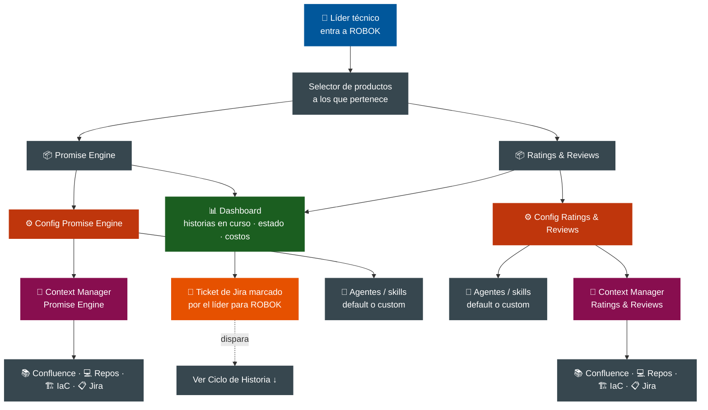

> 🧠 **Cada producto tiene su propio Context Manager**, aislado. No hay cross-contamination de contexto entre productos.

---

## 1.5. Journey del Dev Lead — Etapa 1: Onboarding del producto

### Resumen lineal

### Flujo detallado

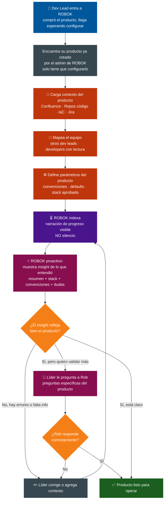

### Lo que aprendimos de esta etapa

**Roles que aparecen:**

- **Admin de ROBOK** (dueño del tenant): controla quién puede crear productos. El dev lead no autocrea.
- **Dev Lead**: configura el producto, mapea equipo, valida contexto. Pueden ser varios por producto.
- **Developer**: parte del equipo, rol con permisos más acotados (a definir).

**Cosas que ROBOK NO mapea:** los ambientes y su infra ya viven en el repo de IaC. ROBOK los lee desde ahí, no los redeclara.

**Validación activa, no pasiva:** ROBOK termina el indexado mostrando un insight de lo que entendió — resumen del producto, stack detectado, convenciones, actividad reciente, y dudas explícitas. El líder corrige o profundiza con preguntas. La confianza nace de ver evidencia digerida, no de un "✓ guardado".

**Anatomía del insight inicial:**

- Resumen del producto en una frase
- Stack detectado (lenguajes, frameworks, dbs, infra)
- Estructura (repos, módulos principales, patrón arquitectónico observado)
- Convenciones detectadas (naming, ubicación de tests, CI/CD)
- Actividad reciente del equipo
- **Cosas que ROBOK no entendió bien** — la honestidad genera confianza
- Equipo mapeado
- Prompt invitacional: "¿algo de esto está mal o falta?"

**Refresh del entendimiento:** estático tras el onboarding, regenerable on-demand por el líder. Cuando ROBOK detecte cambios grandes (nuevo repo, refactor mayor), se ofrece a actualizar el insight.

**Transparencia operacional como requisito no-funcional fuerte:** durante el indexado, narración explícita del progreso. El silencio es la peor fricción posible. La vista del Context Manager debe estar siempre disponible.

---

## 1.6. Journey del Dev Lead — Etapa 2: Selección y priorización del sprint

### Resumen lineal

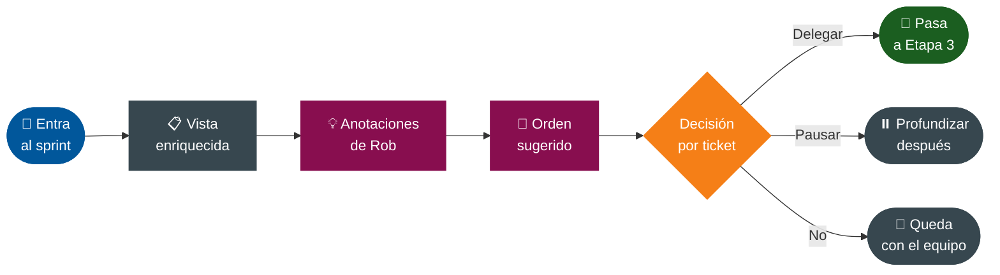

### Flujo detallado

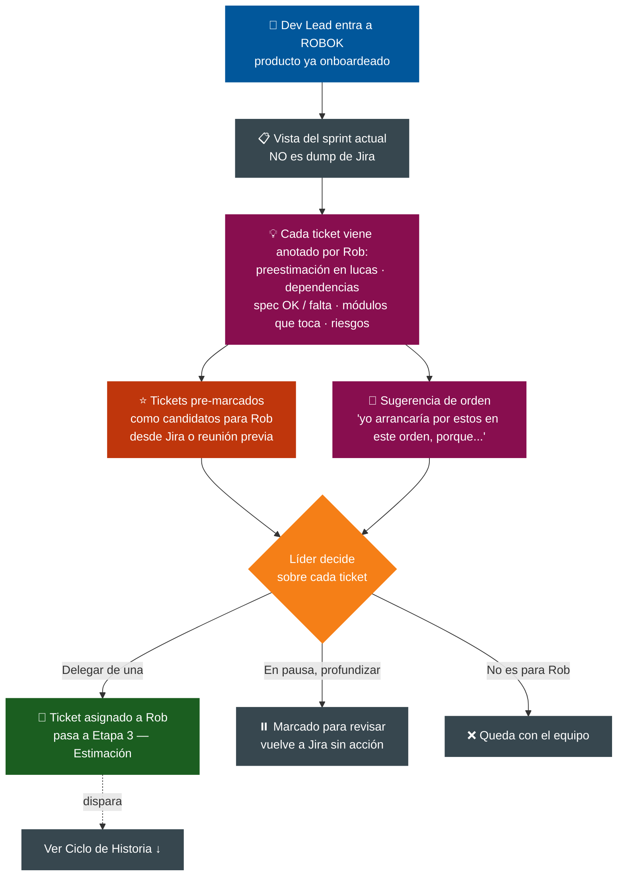

### Lo que aprendimos de esta etapa

**El frame es el sprint actual, no el backlog entero.** Acota el universo a algo manejable (10–20 tickets) y da horizonte temporal claro. El líder no entra a explorar — entra a decidir.

**Rob no opina sobre el qué, opina sobre el cómo.** El líder no decide qué se trabaja — eso ya viene resuelto del planning del equipo. El líder decide qué de lo del sprint delega a Rob para la ejecución. Esto delimita el alcance de Rob de forma sana.

**Dos caminos hacia un ticket marcado para Rob:**

- Pre-marcado en Jira (label, etiqueta, campo custom) desde planning u otra reunión.
- Marcado en el momento por el líder dentro de ROBOK.

**Anatomía del ticket anotado** (insight proactivo aplicado al backlog):

- **Matriz de estimación bidimensional: costo × tiempo.** No solo "USD X" — sino una tabla de modos: Express (horas, full price), Estándar (1 día, normal), Económico (2-3 días, 50% off), Sprint-pace (1-2 semanas, 25-40% del costo). Permite al líder decidir el trade-off según urgencia.
- Calidad de la spec — bien especificado, le falta criterio de aceptación, ambiguo.
- Módulos que toca — qué partes del código se verían afectadas.
- Dependencias — con otros tickets abiertos, con bloqueos conocidos.
- Similitud histórica — "esto se parece a lo que se hizo en el ticket X".
- Riesgos — "este módulo tuvo retrabajo las últimas 3 veces".

**Sugerencia de orden con justificación.** Rob propone un orden óptimo de ejecución y explica por qué. El líder puede aceptarlo, modificarlo o ignorarlo. La sugerencia es input, no decisión.

**Dos decisiones distintas en esta etapa:**

- _Delegar_: Rob, tomá este ticket → pasa a Etapa 3 (Estimación detallada y go/no-go).
- _Pausa para profundizar_: necesito más data antes de decidir → vuelve a Jira sin acción.

**Fricciones a manejar:**

- Jira mal completado (tickets sin descripción, criterios vacíos): Rob no inventa, lo marca como "necesita info" y no lo recomienda hasta que se complete.
- Equipos sin sprints (kanban, iteraciones): ROBOK debe adaptarse a la unidad de trabajo del equipo, no asumir Scrum.
- Bugs vs features tratados distinto por algunos equipos: la vista debe permitir filtrar/agrupar por tipo.

---

## 1.7. Journey del Dev Lead — Etapa 3: Análisis profundo y decisión de delegar

### Resumen lineal

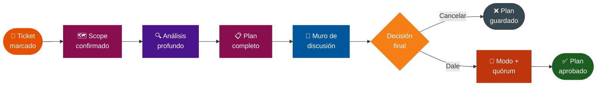

### Flujo detallado

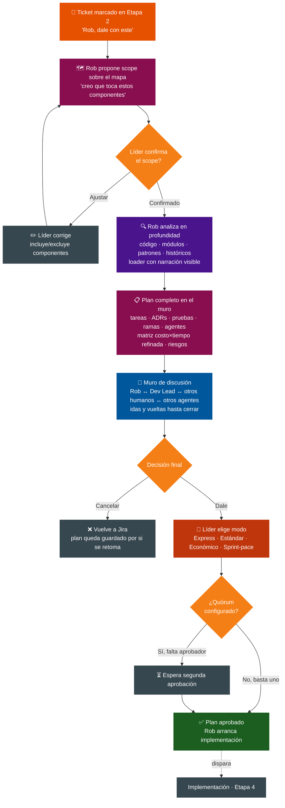

### Lo que aprendimos de esta etapa

**El muro de discusión del plan** es el lugar central de la Etapa 3. No es un documento que se aprueba — es un espacio compartido donde Rob, el dev lead y otros humanos (y otros agentes) discuten. Idas y vueltas. Es la primera materialización concreta del principio "varios humanos debaten con varios agentes". Ahí nacen los ADRs, no después.

**El mapa de componentes como pantalla de primera clase.** Vista permanente del producto: repos, despliegues, dependencias, cloud components. Tiene doble uso: el humano entiende el producto, y al delegar un ticket sirve para acotar scope explícitamente — "esta historia toca solo este subconjunto". Sin esto, Rob analizaría todo el producto y quemaría tokens.

**Inferencia con confirmación humana** como patrón. Rob propone el scope, el líder confirma o corrige antes de que Rob profundice. Esto se aplica a muchas cosas en ROBOK más allá del scope: convenciones detectadas, dependencias inferidas, patrones del producto. Rob nunca ejecuta sobre una inferencia sin que un humano la valide.

**Anatomía del plan completo** (lo que Rob entrega en el muro):

- Descomposición en tareas con dependencias y nivel de paralelización.
- Decisiones arquitectónicas con justificación → de acá salen los ADRs antes de codear.
- Casos de prueba propuestos.
- Condiciones de borde detectadas.
- Estrategia de ramas (una sola o varias, según el grafo de dependencias).
- Cuántos agentes van a trabajar y con qué configuración (LLM específico, skills habilitadas).
- Puntos de control humano con tipo de intervención esperada.
- Riesgos detectados con explicación.
- Matriz costo × tiempo refinada por modo, con justificación de las diferencias respecto a la pre-estimación.

**Configurabilidad de los agentes en este punto.** El líder configuró agentes/skills por defecto en el onboarding, pero acá puede ajustar para esta historia específica. ROBOK no rigidiza la decisión a "lo que se eligió al principio".

**Quórum configurable.** En el onboarding, el dev lead puede definir reglas como:

- "Historias > USD 500 requieren 2 dev leads"
- "Historias que toquen el módulo X requieren aprobador específico"
- "Para todo, basta con uno"

Esto es gobernanza al nivel del producto, que el líder configura. ROBOK no impone un nivel de control universal.

**Manejo del gap costo Etapa 2 vs Etapa 3.** Si la estimación profunda da muy distinta a la pre-estimación, Rob avisa explícitamente con justificación ("salió 3x más caro porque el módulo X no tenía tests, hay que crearlos primero"). El líder decide si seguir o cancelar.

**Plan cancelado se guarda.** Si el líder cancela, el plan queda persistido. Si en otro sprint retoman el ticket, no se rehace el análisis desde cero — Rob recupera el plan, lo refresca con los cambios del producto desde entonces, y muestra el delta.

---

## 1.8. Journey del Dev Lead — Etapa 4: Implementación con squad de agentes

### El concepto: ROBOK Squad

El líder no ve "un agente trabajando" — ve un **squad** trabajando en su historia. La metáfora es la de un equipo de developers en un sprint, no la de un terminal con logs. Cada rol del squad es canónico (Architect, Implementer, Tester, Reviewer, Doc-writer) y configurable por producto en el onboarding.

### Resumen lineal

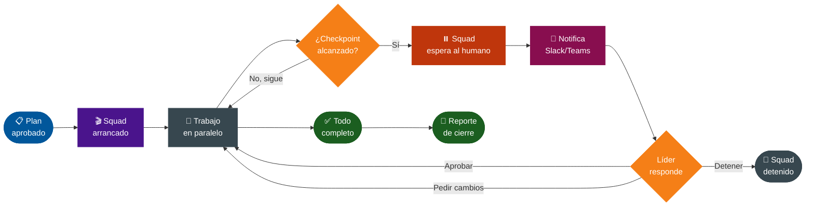

### Flujo detallado

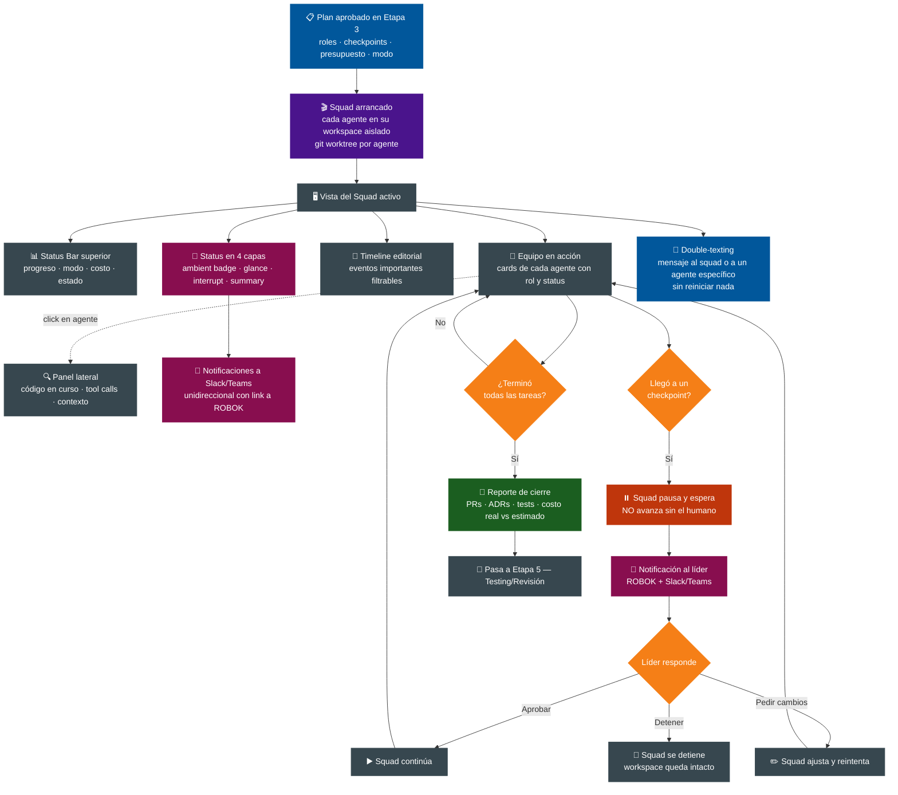

### Anatomía de la pantalla del Squad

**Zona 1 — Status Bar (top, siempre visible)**

- Progreso general (% de tareas completadas)
- Modo elegido y tiempo estimado restante
- Costo actual vs presupuesto aprobado
- Estado global: 🟢 Trabajando · 🟡 Esperándote · 🔴 Bloqueado · ✅ Terminado
- Controles globales: Pausar squad · Detener squad · Pedir actualización

**Zona 2 — El equipo en acción (centro, corazón de la pantalla)** Card por agente activo, con:

- Avatar del rol (🎨 Architect · 🔨 Implementer · 🧪 Tester · 👀 Reviewer · 📝 Doc-writer)
- Tag del agente ("Implementer #2")
- Tarea actual ("Modificando `pricing/calculator.py`")
- Status visual: 🟢 trabajando · 🟡 atascado/pidiendo input · ⚪ idle · 🔴 error
- Mini-progreso de la tarea actual
- Última acción con timestamp ("Hace 30s — escribió 12 líneas")
- Click → drill-down lateral (no navega afuera)

Las **flechas entre cards** muestran handoffs en curso ("Implementer pasó X a Tester"). Vista jerárquica si hay un Orchestrator coordinando. Soporta 1–8 agentes sin rediseño.

**Zona 3 — Timeline editorial (derecha, scrollable)** NO es un log de tool calls — es un feed editorial filtrable de eventos importantes:

- "🎨 Architect terminó el design doc para T-3"
- "🔨 Implementer #1 abrió PR draft `#1234`"
- "🧪 Tester en T-1: 23 pasaron, 1 falló — investigando"
- "⚠️ Implementer #2 pidió tu input sobre naming"
- "✅ Tarea T-2 cerrada"

Filtros: por agente · por tipo de evento · por severidad. Click en un evento → jump-to-artifact (PR, archivo, ADR).

### Status en 4 capas (presencia adaptativa)

|Capa|Cuándo|Dónde|Demanda atención|
|---|---|---|---|
|**Ambient**|Mientras el squad trabaja|Badge persistente en cualquier pantalla de ROBOK|No|
|**Glanceable**|Hover sobre el badge|Mini-panel con resumen|Voluntaria|
|**Interrupting**|Squad llegó a checkpoint|Notificación visible + Slack/Teams|Sí, requiere acción|
|**Summary**|Squad terminó|Reporte de cierre completo|Voluntaria|

El líder elige cuánto involucrarse. La vista "ROBOK Squad" no demanda atención constante — solo cuando algo importante pasa.

### Patrones clave que diferencian a ROBOK

**Squad espera al humano en checkpoints — siempre.** ROBOK no avanza sin el dev lead en gates críticos. Aunque sea overnight, aunque el modo elegido sea Sprint-pace, los checkpoints duros bloquean el progreso. Es una postura conservadora, deliberada y segura. Lo opuesto a Devin (que avanza con su mejor opción).

**Workspace aislado por agente.** Cada agente del squad trabaja en su propio git worktree (o equivalente), sin pisarse con otros agentes. El Orchestrator integra los resultados al final de cada checkpoint. Sin esto, los agentes paralelos se chocan.

**Double-texting habilitado.** El líder puede mandar mensajes al squad o a un agente específico mientras corre, sin tener que reiniciarlo. El mensaje se inyecta en la siguiente decisión del agente — espera a que termine su tool call actual, lo ingiere, ajusta. Es muy diferente de "para todo, escribí, retomá".

**Drill-down sin perder contexto.** Click en un agente abre panel lateral con su detalle profundo (archivo en edición, tool calls, contexto, decisiones recientes). Cerrar el panel vuelve a la vista del squad. Nunca perdés la vista global.

**Notificaciones a Slack/Teams unidireccionales en V1.** Cuando el squad llega a un checkpoint, llegan al canal del producto (o DM al líder) con link directo a la pantalla de aprobación en ROBOK. V1 = notificación con link. V2 = aprobar desde Slack/Teams sin entrar a ROBOK.

### Roles canónicos del squad (V1)

ROBOK trae 6 roles canónicos. Cada uno es **configurable por producto** en el onboarding (qué LLM usa, qué skills tiene, qué prompts personalizados). En V2 se podrán crear roles custom.

|Rol|Responsabilidad|Naturaleza|
|---|---|---|
|🎨 **Architect**|Diseño técnico, decisiones arquitectónicas, ADRs|Toma tareas en el plan|
|🔨 **Implementer**|Escribir código según el plan|Toma tareas en el plan|
|🧪 **Tester**|Pruebas unitarias, integración, casos borde|Toma tareas en el plan|
|👀 **Reviewer**|Revisión de código, calidad, convenciones|Toma tareas en el plan|
|📝 **Doc-writer**|Documentación, comentarios, actualización de wikis|Toma tareas en el plan|
|🛡️ **Security Reviewer**|Auditor del squad — revisa diseño, código y resultados de pipelines|**No toma tareas** — observa y challengea en momentos clave (Etapas 3, 4 y 5)|

**El Security Reviewer es transversal**, no toma tareas como los otros. Aparece en:

- **Etapa 3** (muro de discusión): challengea el plan desde la dimensión de seguridad — auth, datos sensibles, endpoints públicos, dependencias nuevas, modelo de permisos.
- **Etapa 4** (implementación): audita el código generado por los Implementers en checkpoints — secrets, validación de inputs, patrones inseguros, manejo de errores, uso de cripto.
- **Etapa 5** (Pre-merge Gate): orquesta SAST, DAST, secret scanning, vulnerability scanning. Escucha señales del pipeline del repo y decide cómo responder a errores (ver "External signal listening" abajo).

Si el squad necesita coordinación entre varios agentes (orchestrator pattern), ROBOK lo activa automáticamente. El líder ve la jerarquía en la vista del squad.

### Lo que NO se muestra por defecto

- **Tool calls crudos**: ruido para el líder. Quedan en drill-down profundo, no en la vista principal.
- **Tokens consumidos en tiempo real**: genera ansiedad sin valor. Costo acumulado vs presupuesto sí, en Zona 1.
- **Vista tipo chat**: el chat es secundario, la vista de squad es central. Chat con un agente específico se accede desde su drill-down.

### Fricciones a manejar

- **Re-entry cost**: el líder vuelve después de horas. Necesita reorientarse rápido. Solución: la vista del squad muestra "novedades desde tu última visita" como filtro por defecto en el timeline.
- **Squad bloqueado por el humano demasiado tiempo**: si un checkpoint queda sin respuesta más de N horas, ROBOK manda recordatorio. No avanza solo, pero avisa.
- **Conflictos entre agentes paralelos**: dos Implementers tocan archivos relacionados. El Orchestrator detecta y consolida — si no puede, eleva al líder como checkpoint extra.
- **Costo se desboca**: si el costo real supera al estimado por X% (configurable), squad se pausa automáticamente y notifica al líder.

### External signal listening — el squad sigue vivo después del PR

Cuando el squad abre un PR, **no se desactiva**. Queda en estado _in-flight_ escuchando señales externas del repo y del pipeline:

- Pipeline de CI finalizó (success/failure)
- SAST reportó vulnerabilidades nuevas
- Tests de regresión del CI fallaron
- Code coverage bajó
- Dependency scan encontró CVE crítica
- Lint failed

Cuando llega un evento, el agente correspondiente (típicamente el Security Reviewer para señales de seguridad, el Tester para fallos de tests) lo procesa y propone un **camino de respuesta**. La decisión depende del tipo de error:

|Camino|Cuándo aplica|Cómo responde el squad|
|---|---|---|
|**Auto-fix**|Errores menores y mecánicos (secret hardcodeado, lint, dep desactualizada con CVE menor)|Security Reviewer redacta el fix, abre tarea en el squad, Implementer la ejecuta. Sin pasar por Etapa 3.|
|**Vuelta a Etapa 3**|Errores que cambian el diseño (dependencia con CVE crítica, modelo de permisos insuficiente, patrón cripto deprecado)|Security Reviewer abre thread en el muro de discusión. Líder participa. Plan se actualiza.|
|**Excepción aprobada**|Falso positivo conocido o error legítimo de ignorar|Security Reviewer propone "ignorar con justificación". **Líder aprueba explícitamente**. Queda como ADR.|
|**Bloqueante absoluto**|Secret leakeado, CVE crítica en core, regresión confirmada|Merge denegado. Líder toma decisión grande (rollback, replan, escalar).|

El Security Reviewer **propone el camino** y el líder **confirma** (inferencia con confirmación humana, otra vez). Esto da control al líder sin obligarlo a micromanagear.

**Postura conservadora:** los auto-fixes se preparan pero no se aplican sin OK del líder. Si el pipeline falla a las 2am, el Security Reviewer redacta la solución y espera. Coherente con el principio "el squad espera al humano en checkpoints".

---

## 1.9. Journey del Dev Lead — Etapa 5: Pre-merge Gate

### El concepto

Etapa 5 NO es "testing" en el sentido tradicional. El testing del código nuevo ya lo hizo el squad en Etapa 4 (rol Tester). Acá lo que se valida es distinto: **¿la feature funciona end-to-end? ¿no rompe nada existente? ¿el sistema sigue saludable?** Es un gate de validación holística antes del merge.

Es la etapa más compleja del ciclo porque toca infraestructura externa que ROBOK no controla (pipelines, ambientes, herramientas de QA del equipo). Por eso se diseña con un corte explícito V1 / V2 / V3 — no se intenta hacer todo de una.

### Resumen lineal (V1)

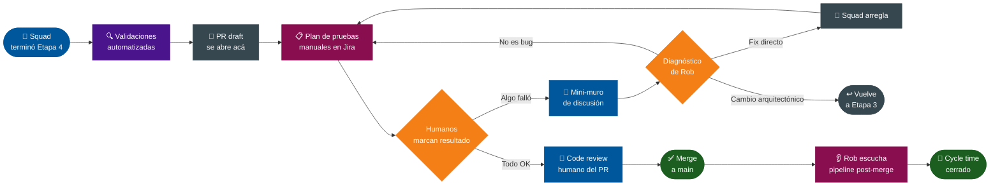

### Flujo detallado (V1)

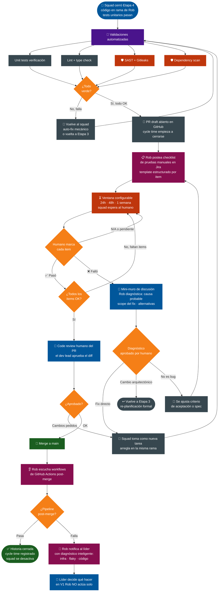

### Lo que hace V1

**Validaciones automatizadas pre-PR:**

- Unit tests verificación (re-correr lo que el squad ya escribió)
- Lint + type check según config del repo
- SAST básico: Semgrep o equivalente
- Secret scanning: Gitleaks
- Dependency scan: Trivy o equivalente

**Plan de pruebas manuales en Jira:**

- Rob postea un comentario estructurado con checklist
- Cada item tiene un template predefinido para que el humano marque resultado
- Estados posibles por item: ✅ pasó · ❌ falló · ⏸️ pendiente · N/A
- Si falla: template requiere pasos para reproducir, screenshot, comportamiento esperado vs actual

**Mini-muro de discusión cuando algo falla:**

- Rob diagnóstica el reporte estructurado del humano
- Propone categoría: fix directo / cambio arquitectónico / no es bug
- Humano valida el diagnóstico
- Salida del mini-muro determina el camino

**Listening del pipeline post-merge (sin auto-fix):**

- Rob escucha workflows de GitHub Actions
- Cuando un workflow termina, registra el resultado
- Si falla, **diagnóstica inteligentemente** (infra / flaky / código real)
- Notifica al líder con contexto y links
- En V1 Rob NO actúa solo — solo informa

**Métricas:**

- Cycle time desde "Rob, dale" en Etapa 3 hasta merge
- Tiempo promedio de cada sub-fase del Pre-merge Gate
- Tasa de fallas en pruebas manuales
- Tasa de fallas post-merge

### Lo que se posterga a V2

- **Auto-fix sobre fallas del pipeline post-merge** (Rob propone fix con approval humano, no solo informa)
- **Smoke E2E pre-merge contra ambiente dedicado de ROBOK** (containerizado, on-demand)
- **Mutation testing como verificación** de tests modificados (detector del "verde mentiroso")
- **Performance comparison y visual regression** automatizados
- **Soporte explícito a ambientes ephemeral** del cliente (Vercel, Netlify, Argo PR previews)

### Lo que se posterga a V3+ (o "no por ahora")

- **Code review humano automatizado** (el Reviewer agent de Etapa 4 puede preparar un primer pase, pero el dev lead sigue siendo quien aprueba)
- **Reproducción automática de bugs** reportados por humanos
- **Generación automática de tests E2E nuevos** para gaps de cobertura
- **DAST en ambiente real**

### Patrones clave de esta etapa

**El PR draft se abre al final, no al comienzo.** Antes del PR todo el trabajo vive en la rama de Rob sin abrirse a GitHub. El PR es la primera señal externa de "esto está listo para entrar al pipeline del equipo". Esto da un cycle time limpio y comparable.

**El loop de fix usa el mismo patrón que external signal listening.** Las señales adversas — vengan de tests automatizados, SAST, o humanos marcando "falló" — se procesan con la misma mecánica: diagnóstico + clasificación + mini-muro + decisión. Esto le da coherencia a ROBOK.

**Code review humano es no-negociable en V1.** Aunque el Reviewer agent existe en Etapa 4 y revisa internamente, el merge final requiere review humano del dev lead. El squad propone, el humano aprueba. Sin excepciones.

**Tests rotos NO se auto-arreglan.** Si un test falla, el squad propone un diff y el humano aprueba el diff explícitamente. El "verde mentiroso" — donde un test mal arreglado oculta un bug real — es el riesgo más serio en testing con IA. ROBOK no lo permite por diseño.

**Trunk-based development es requisito del producto.** ROBOK V1 requiere que el equipo trabaje con ramas de horas, no días. Si el cliente usa Gitflow con ramas de larga vida, ROBOK no es para ellos todavía. Es un filtro de mercado deliberado.

### Fricciones a manejar

- **Ambientes E2E del cliente**: muchos equipos no tienen un staging compartido y limpio. En V1 ROBOK no levanta ambientes — depende del pipeline del equipo. En V2 puede aportar uno propio para smoke pre-merge.
- **Pipelines no estándar**: cada equipo tiene su CI configurado distinto. ROBOK escucha eventos estándar de GitHub Actions / GitLab CI / Bitbucket Pipelines. Otros pipelines requieren integración custom.
- **Pruebas manuales que tardan demasiado**: si la ventana es 1 semana y el equipo no las hizo, ROBOK manda recordatorio pero NO avanza solo. Coherente con principio 18.
- **Tests flaky que generan ruido**: el diagnóstico de Rob clasifica fallas como flaky cuando ve patrón histórico. Si un test es flaky crónico, el dev lead puede excluirlo del set bloqueante.
- **Bug reportado en pruebas manuales pero no reproducible por Rob**: en V1 Rob no intenta reproducir, solo lo escala al squad con el reporte estructurado. El squad investiga.

---

## 2. Vista global — el ciclo de la historia y dónde encaja cada Etapa

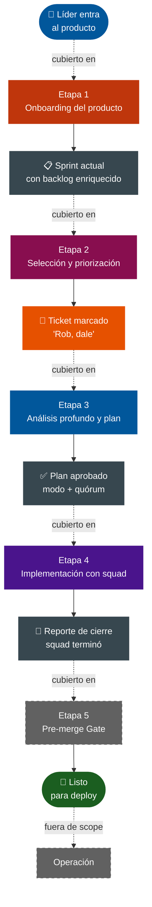

> **Cobertura actual del diseño:** ✅ Etapa 1 — Onboarding del producto · ✅ Etapa 2 — Selección · ✅ Etapa 3 — Análisis y plan · ✅ Etapa 4 — Implementación con squad · ✅ Etapa 5 — Pre-merge Gate 🚫 Operación — fuera de scope

---

## Principios

Esta sección es la columna vertebral del producto. Está organizada en **cuatro grupos temáticos** con **dos principios por grupo**. Cada principio se enuncia en una línea, explica por qué importa, y se materializa en manifestaciones concretas — para que ningún matiz se pierda.

---

### 🪨 Foundational — qué es ROBOK

#### **P1. Dogfooding como ley de gravedad**

**Enunciado:** ROBOK se construye con ROBOK.

**Por qué importa:** si ROBOK no es lo suficientemente bueno como para construirlo a sí mismo, no es vendible. Esto fuerza honestidad, te empuja contra la sobreingeniería, te da evidencia para vender, y autodefine el orden de construcción del producto.

**Cómo se materializa:**

- Vos sos el primer dev lead.
- Este repo es el primer producto onboardeado en ROBOK.
- Las features de ROBOK se desarrollan con Rob.
- El roadmap del producto coincide con el orden necesario para usarlo a sí mismo (no podés construir Etapa 4 antes de Etapa 2 — porque vas a usar Etapa 2 para construir Etapa 4).

---

#### **P2. El producto es la unidad de todo**

**Enunciado:** Todo en ROBOK se organiza alrededor del producto.

**Por qué importa:** el producto es la unidad natural alrededor de la cual viven equipos, repos, decisiones y contexto. Es lo que hace que ROBOK escale más allá de un equipo sin perder coherencia. Sin esta unidad explícita, ROBOK termina siendo un agente glorificado.

**Cómo se materializa:**

- **Cada producto tiene su Context Manager aislado**: un agente trabajando en Promise Engine no ve código de Ratings & Reviews salvo gate explícito.
- **El producto es la unidad de configuración**: contexto (repos, doc, IaC, Jira), parámetros (agentes, skills, frameworks), equipo (dev leads y developers).
- **Provisioning controlado**: los productos los provisiona el admin de ROBOK. El dev lead los configura, no los autocrea.
- **El equipo se mapea dentro del producto**: dev leads y developers con permisos diferenciados.

---

### 🛡️ Control — quién manda

#### **P3. El humano lidera, los agentes asisten — siempre**

**Enunciado:** ROBOK propone, el humano decide. Los gates humanos son no-negociables.

**Por qué importa:** este es el principio que más nos diferencia. Productos como Devin avanzan con su mejor opción si el humano no responde. Nosotros no. Preferimos esperar antes que equivocarnos. Define el contrato de confianza con el líder.

**Cómo se materializa:**

- **Inferencia con confirmación humana**: Rob nunca ejecuta sobre una inferencia propia. Propone con justificación, el humano confirma o corrige, recién entonces actúa. Aplica al scope de un ticket, a las convenciones detectadas, a las dependencias, a todo lo que Rob "cree" sobre el producto.
- **El squad espera al humano en checkpoints**: aunque sea overnight, aunque el modo elegido sea Sprint-pace, los gates duros bloquean el progreso. Sin excepciones.
- **Code review humano del PR es no-negociable**: el Reviewer agent del squad revisa internamente, pero el merge final requiere aprobación humana del dev lead.
- **Tests rotos NO se auto-arreglan — propose-diff-then-approve**: si un test falla, Rob propone un diff y el humano aprueba explícitamente. El "verde mentiroso" (un test mal arreglado que oculta un bug real) es el riesgo más serio en testing con IA. ROBOK no lo permite por diseño.

---

#### **P4. Gobernanza configurable en capas**

**Enunciado:** ROBOK reconoce tres niveles de control y los hace explícitos. Cada equipo elige su trade-off entre velocidad y resguardo.

**Por qué importa:** equipos distintos tienen culturas distintas de control. Un equipo con regulación financiera necesita más rigor que uno de un consumer interno. ROBOK no impone un nivel universal — provee defaults sensatos y la posibilidad de ajustarlos.

**Cómo se materializa:**

- **Tres niveles de gobernanza**:
    - Nivel **ROBOK** (admin): qué productos existen, quién es admin de cada uno.
    - Nivel **Producto** (dev leads): qué se configura, quién está en el equipo, qué agentes y skills se usan, qué reglas de quórum.
    - Nivel **Historia** (dev lead delegante): qué se delega, qué se aprueba, qué modo de costo×tiempo.
- **Varios dev leads por producto**: las decisiones críticas pueden emerger del debate cruzado entre múltiples humanos y múltiples agentes. El "mejor diseño" no es el que un líder solo aprueba — es el que sobrevive al challenge del equipo.
- **Reglas de quórum configurables**: "historias > USD 500 requieren 2 dev leads", "historias que toquen el módulo X requieren aprobador específico", "para todo basta uno".
- **Restricciones por módulo**: ciertos módulos pueden tener políticas de control más estrictas que otros.
- **Configurabilidad de defaults**: cada equipo ajusta sus agentes, skills, prompts, frameworks de descomposición. Sin prescriptividad rígida.

---

### 👁️ Transparencia — cómo se ve el trabajo

#### **P5. Demostrar entendimiento, no declararlo**

**Enunciado:** ROBOK nunca dice "✓ listo" sin mostrar evidencia. Mostrá tu trabajo es la filosofía transversal.

**Por qué importa:** la confianza nace de ver el trabajo, no de un check verde. Cuando ROBOK muestra qué entendió, el humano puede juzgar la calidad por la sustancia. Esto vale para todas las etapas y se convierte en el sello del producto.

**Cómo se materializa:**

- **Insight proactivo en operaciones grandes**: al terminar el onboarding ROBOK muestra qué entendió del producto (resumen, stack, convenciones, dudas explícitas). Al estimar, justifica con datos. Al diseñar, basa en código real. Al revisar, cita los criterios verificados.
- **Validación conversacional, no wizard**: el dev lead valida el onboarding preguntándole a Rob, no haciendo clic en "confirmar".
- **El muro de discusión** (Etapa 3): las decisiones críticas se debaten en un espacio compartido entre humanos y agentes, no se aprueban en un documento. La aprobación es resultado del debate, no un click después de leer un PDF.
- **Mismo patrón para señales adversas**: tests automatizados rotos, SAST con vulnerabilidad, humano marcando "falló" en pruebas manuales — todas se procesan con el mismo flujo: **diagnóstico + clasificación + mini-muro + decisión humana**. Esta coherencia hace a ROBOK predecible.

---

#### **P6. Presencia adaptativa, no opacidad ni demanda constante**

**Enunciado:** El humano nunca debe estar a oscuras, pero tampoco forzado a mirar.

**Por qué importa:** el silencio es la peor fricción posible — pero el ruido constante también lo es. ROBOK ofrece visibilidad escalonada, donde el humano elige su nivel de involucramiento. Esto baja la curva de aprendizaje y hace que el dev lead pueda delegar con tranquilidad.

**Cómo se materializa:**

- **Status en cuatro capas**:
    - **Ambient**: badge persistente en cualquier pantalla, no demanda atención.
    - **Glanceable**: hover/click rápido para resumen, demanda voluntaria.
    - **Interrupting**: notificación con acción cuando ROBOK necesita al humano, demanda obligatoria.
    - **Summary**: reporte completo al cierre, voluntario.
- **Narración explícita en operaciones largas**: indexado, análisis profundo, generación. El líder ve qué está pasando paso a paso, no solo el resultado final.
- **Vistas de primera clase**:
    - El **mapa de componentes**: repos, servicios, infra, dependencias del producto siempre a la vista. Sirve para entender el sistema y para acotar scope al delegar una historia.
    - La **vista del squad**: los agentes se ven como un equipo de developers en un sprint, no como logs o terminales. Cards con rol, tarea actual, status. La metáfora visual es Jira+gente, no `tail -f`.

---

### ⚙️ Operación — cómo trabajan los agentes

#### **P7. Trabajo informado por contexto fresco y versionado**

**Enunciado:** Los agentes operan con contexto curado del producto. Cada decisión queda anclada al snapshot del estado en que se tomó.

**Por qué importa:** sin contexto fresco los agentes inventan. Sin contexto versionado las decisiones pierden sentido al cambiar el mundo. Auditar una decisión seis meses después requiere reconstruir el mundo en que se tomó. Sin esto los ADRs son frases sueltas; con esto son contratos verificables.

**Cómo se materializa:**

- **Contexto fresco**: los agentes acceden a código, doc, ADRs, convenciones y mapa de componentes actualizados.
- **Trazabilidad del estado, no solo de eventos**: cada plan, decisión y ADR guarda referencia al snapshot del estado del producto en ese momento.
- **El mapa de componentes está versionado**: cuando creaste la historia el mapa tenía X forma. Al cabo de meses cambió. Para auditar la decisión necesitás la foto del momento.
- **Cada plan en el muro guarda referencia al snapshot**, no al estado mutable.

---

#### **P8. Decisiones bidimensionales: el humano elige el trade-off**

**Enunciado:** ROBOK no impone una sola forma de trabajar. Las decisiones operativas siempre exponen el trade-off al humano.

**Por qué importa:** el valor del producto no es "Rob hace todo automágicamente" — es "Rob te da poder para decidir con datos". Cada decisión expone el trade-off real (costo, tiempo, alcance) para que el humano elija.

**Cómo se materializa:**

- **Costo × tiempo en delegación**: el líder elige el modo de ejecución por historia.
    - **Express** — full price, horas. Para urgente.
    - **Estándar** — precio normal, día. Para flujo normal.
    - **Económico** — batch, 2–3 días, ~50% off. Para cuando velocidad no es crítica.
    - **Sprint-pace** — semana a 25–40% del costo. Mismo tiempo que un sprint humano, fracción del costo. Inspirado en cloud spot pricing y aprovechando el Batch API de los LLMs (50% off async).
- **Estimación con datos, no abstracción**: tamaño + complejidad + costo monetario en lucas. Justificado en evidencia. El líder delega con números a la vista.
- **Rob opina sobre el cómo, no sobre el qué**: lo que se trabaja lo decide el equipo en planning. ROBOK ayuda a ejecutar lo decidido con calidad y velocidad. No es product manager.
- **Double-texting habilitado**: el líder puede dirigir al squad o a un agente específico mientras está corriendo, sin reiniciar. Es la diferencia entre supervisar un equipo y debuggear un proceso.

---

## Preguntas abiertas (para profundizar)

- [ ] **Carga del equipo**: ¿el dev lead invita uno por uno o ROBOK consume de Jira/Slack/AD? Trade-off entre fricción y control.
- [ ] **Refresh del contexto**: ¿cómo se mantiene fresco a lo largo del tiempo? ¿automático, on-demand, triggered por eventos?
- [ ] **Permisos del Developer**: además de visualizar, ¿puede comentar? ¿puede challengear el diseño? ¿solo aprobaciones quedan en el dev lead?
- [ ] **Context Manager — push o pull?** ¿El agente pide lo que necesita, o el Context Manager le entrega contexto curado según su rol y fase? Probable híbrido.
- [ ] **Diseño**: ¿cómo se materializa el "challenge"? ¿sesión interactiva, PR de design doc, hilo de Slack?
- [ ] **Costo estimado**: ¿tiempo de equipo, tokens, ambos? ¿quién valida la estimación?
- [ ] **Descomposición**: ¿el líder valida antes de implementar o ROBOK ejecuta y muestra resultado?

---

## Decisiones cerradas

### Producto y mercado

- ✅ **Productos los provisiona el admin de ROBOK**, no los autocrea el dev lead.
- ✅ **Trunk-based development es requisito de ROBOK V1.** Filtro de mercado deliberado — los equipos que ya hacen DORA-elite con TBD son el cliente ideal. Ramas de larga vida son anti-patrón con agentes (snapshot del agente queda obsoleto cuando main se mueve).
- ✅ **Modelo de tiers de velocidad/costo** inspirado en cloud spot pricing y aprovechando el Batch API de los LLMs (50% off async). El líder elige modo (Express / Estándar / Económico / Sprint-pace) por ticket. Es eje de diferenciación de producto.
- ✅ **Squad como metáfora de presentación.** No terminales, no logs, no chat — equipo de developers visible con cards por agente, status, tarea actual. La metáfora visual baja la curva de aprendizaje de los líderes técnicos.

### Alcance

- ✅ **Ambientes quedan fuera del alcance de ROBOK** — viven en el repo de IaC y se leen desde ahí.
- ✅ **El líder puede tener múltiples historias en curso en paralelo.** Vista de "mis historias en curso" antes de bajar al squad de cada una.
- ✅ **Etapa 2 = análisis liviano de muchos. Etapa 3 = análisis profundo de uno.** No mezclar — sería caro y lento.

### Onboarding

- ✅ **El onboarding se valida conversando**, no haciendo clic en "confirmar". El insight proactivo de Rob al terminar el indexado es lo que da confianza.

### Diseño y plan (Etapa 3)

- ✅ **El plan se discute en un muro colaborativo**, no en un documento.
- ✅ **Mapa de componentes como vista permanente del producto**, configurable y siempre disponible.
- ✅ **El mapa de componentes está versionado.** Cada decisión, plan y ADR queda anclado al snapshot del estado del producto en ese momento.
- ✅ **El plan cancelado se guarda**. Si se retoma en otro sprint, Rob hace refresh sobre el plan existente, no análisis desde cero.

### Implementación (Etapa 4)

- ✅ **6 roles canónicos en V1**: Architect, Implementer, Tester, Reviewer, Doc-writer, **Security Reviewer**. Configurables por producto (LLM, skills, prompts). Roles custom en V2.
- ✅ **Security Reviewer es transversal** — no toma tareas, audita en Etapas 3, 4 y 5. **Shift-left de seguridad por diseño**: atrapar problemas en el diseño es 10x más barato que en el código.
- ✅ **1 a 8 agentes por squad** soportados sin rediseño. La mayoría de las historias usará 1–3.
- ✅ **Workspace aislado por agente** (git worktree o equivalente). El Orchestrator integra al final de cada checkpoint.
- ✅ **Notificaciones a Slack/Teams unidireccionales en V1** — link a la pantalla de aprobación en ROBOK. Bidireccionalidad en V2.

### Pre-merge Gate (Etapa 5)

- ✅ **Etapa 5 se llama "Pre-merge Gate"** (no Testing). Honesto sobre lo que es: validación holística antes del merge.
- ✅ **PR draft se abre al final, no al comienzo.** Cycle time limpio. Antes del PR, el trabajo vive en la rama de Rob sin GitHub.
- ✅ **External signal listening**: el squad escucha eventos del pipeline después del PR (SAST, CI, dependency scans). No se desactiva hasta el merge. Responde con uno de cuatro caminos: auto-fix, vuelta a Etapa 3, excepción aprobada, o bloqueante.
- ✅ **V1 de Pre-merge Gate cubre**: validaciones automatizadas (lint, type, SAST, deps, secrets), plan de pruebas manuales estructurado en Jira, mini-muro de discusión para fixes, listening del pipeline post-merge con diagnóstico (sin auto-fix), cycle time tracking.
- ✅ **V2 agrega**: auto-fix sobre fallas del pipeline, smoke E2E pre-merge con ambiente dedicado, mutation testing, performance/visual regression, soporte a ambientes ephemeral del cliente.
- ✅ **V3+ deja**: code review humano automatizado, reproducción automática de bugs, generación de tests E2E nuevos, DAST en ambiente real.
- ✅ **Listening de pipeline en V1 es informativo, no actuativo.** Rob escucha, registra, diagnostica y notifica. No abre fixes. Eso es V2.

---